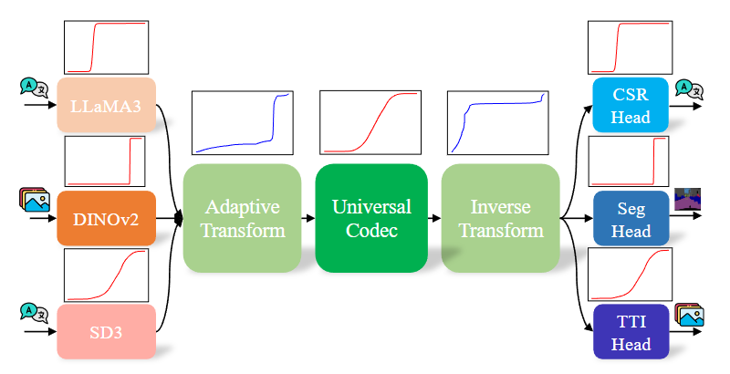

# Introduction

This project is the official implementation of the paper titled **“[DT-UFC: Universal Large Model Feature Coding via Peaky-to-Balanced Distribution Transformation](https://arxiv.org/abs/2506.16495)”**. 

**"Universal Feature Coding"** is a key branch of the field of **"Coding for Machines"**, focusing on scenarios where a neural network is divided into multiple parts and deployed across different devices. In such cases, the intermediate features are encoded and transmitted between devices. The primary goal of feature coding is to minimize the bitrate under a certain constraint of task accuracy or maxmize the task accuracy under a certain constraint of bitrate.

We divide the source codes into two folders: *coding and machines*. 
The *“coding”* folder includes codes related to feature coding and the *“machines”* folder includes codes related to the machines algorithms (feature extraction and task evaluation).

<p align="center">
  
</p>

# Key Features

- ## Support 3 large models and 1 CNN model
    - **LLaMA3:** Common Sense Reasoning task
    - **DINOv2:** Semantic Segmentation task
    - **SD3:** Text-to-Image Synthesis task
    - **ResNet50:** Image Classification task


- ## Include 2 Learning-based Codecs
    - **Hyperprior** 
    - **ELIC**

# Environments Set Up

## Coding

- **CompressAI** 

    - Step 1: build the docker image from *“docker/dockerfile_compressai_llama3”*. For example, a docker image named *“gaocs/compressai_llama3:2.0.0-cuda11.7-cudnn8-runtime”* will be built by running:

        `docker build -t gaocs/compressai_llama3:2.0.0-cuda11.7-cudnn8-runtime`

    - Step 2: Enter a docker container and run the command below to install CompressAI in editable mode:

        `cd coding/CompressAI; pip install -e .`

    Please note that the docker image only provides the running environment. We modified the original CompressAI library and thus the local installation is required. The local installation takes time to solve the dependencies. 

## Machines

- **DINOv2:** build the docker image from *“docker/dockerfile_dinov2”*.

- **Llama3:** build the docker image from *“docker/dockerfile_compressai_llama3”*. Then run:

    `cd machines/llama3/transformers; pip install -e .`

- **Stable Diffusion 3:** build the docker image from *“docker/dockerfile_sd3”*. Then run:

    `cd machines/sd3/diffuers; pip install -e .`

    Please note that the feature extraction depends on specific pytorch versions. To obtain identical features, please follow the environmental setups.

# Usage Guidelines

We divide the source codes into two folders: *coding and machines*. 
The *“coding”* folder includes codes related to feature coding and the *“machines”* folder includes codes related to the machines algorithms (feature extraction and task evaluation).

## Coding

- ### Distribution Transformation

    Config the parameters accordingly and derive the nonlinear transform mapping through:

    `cd coding/transform; python nonlinear_transform.py`

- ### Codec Training

    Config the parameters accordingly and generate the transformed training data from original extracted features using the below command. Generate training data before training saves the training time. For the original feature extraction, please refer to "[chansongoal/LaMoFC](https://github.com/chansongoal/LaMoFC)"

    `cd coding/transform; python generate_data.py`
    
    Set up the configurations and arrange the corresponding folders. Then run:

    `cd coding/CompressAI/; python run_batch.py`

    We have organized the training and inference processes in one single file *“run_batch.py”*. This file will generate two commands for training *(train_cmd)* and inference *(eval_cmd)* respectively. The validation loss curves will also be plotted after training. 

## Machines

The feature extraction and task evaluation process use the same codes. You are free to skip the feature extraction if you have downloaded the test dataset.

- ### Llama3

    - **Common Sense Reasoning:** Config the parameters accordingly in *“machines/llama3/llama3.py”* and run:

        `cd machines/llama3; python llama3.py`

- ### DINOv2
    - **Semantic Segmentation:** Config the parameters accordingly and run:

        `cd machines/dinov2/; python seg.py`

- ### Stable Diffusion 3

    - **Text-to-Image Synthesis:** Config the parameters accordingly and run:

        `cd machines/sd3/; python sd3.py`


# Related Links
## Pretrained Codecs

Download from the below links and put them in the corresponding folders. 
- **Hyperprior:**
<https://huggingface.co/chansongoal/DT-UFC/tree/main/hyperprior_hybrid>

- **ELIC:**
<https://huggingface.co/chansongoal/DT-UFC/tree/main/elic_hybrid>

## Pretrained Transform Mapping
Download from the below links and put them in the corresponding folders. 

- **Transform Mapping:**
<https://huggingface.co/chansongoal/DT-UFC/tree/main/transform_mapping>

## Pretrained Machine Models

Download from the below links and put them in the *“Data_example/model_type/task/pretrained_head”* folder. Please make sure the folder is consistent with the codes.

- **DINOv2 backbone:**
<https://dl.fbaipublicfiles.com/dinov2/dinov2_vitg14/dinov2_vitg14_pretrain.pth>

    - **Classification head:**
<https://dl.fbaipublicfiles.com/dinov2/dinov2_vitg14/dinov2_vitg14_linear_head.pth>

    - **Segmentation head:**
<https://dl.fbaipublicfiles.com/dinov2/dinov2_vitg14/dinov2_vitg14_voc2012_linear_head.pth>

    - **Depth estimation head:**
<https://dl.fbaipublicfiles.com/dinov2/dinov2_vitg14/dinov2_vitg14_nyu_linear4_head.pth>

- **Llama3:**
<https://huggingface.co/meta-llama/Meta-Llama-3-8B-Instruct/tree/main>

- **Stable Diffusion 3:**
<https://huggingface.co/stabilityai/stable-diffusion-3-medium-diffusers/tree/main>

## 📚 Citation

If you use our dataset or evaluation tools, please cite the following paper:

```bibtex
@inproceedings{gao2025dtufc,
    author = {Gao, Changsheng and Liu, Zijie and Li, Li and Liu, Dong and Sun, Xiaoyan and Lin, Weisi},
    title = {{DT-UFC}: Universal Large Model Feature Coding via Peaky-to-Balanced Distribution Transformation},
    year = {2025},
    isbn = {9798400720352},
    publisher = {Association for Computing Machinery},
    address = {New York, NY, USA},
    doi = {10.1145/3746027.3755814},
    booktitle = {Proceedings of the 33rd ACM International Conference on Multimedia},
    pages = {5198–5207},
    keywords = {coding for machines, feature coding, large models},
    location = {Dublin, Ireland},
    series = {MM '25}
}
```

## License

This project is licensed under the MIT License. See the [LICENSE](./LICENSE) file for details.